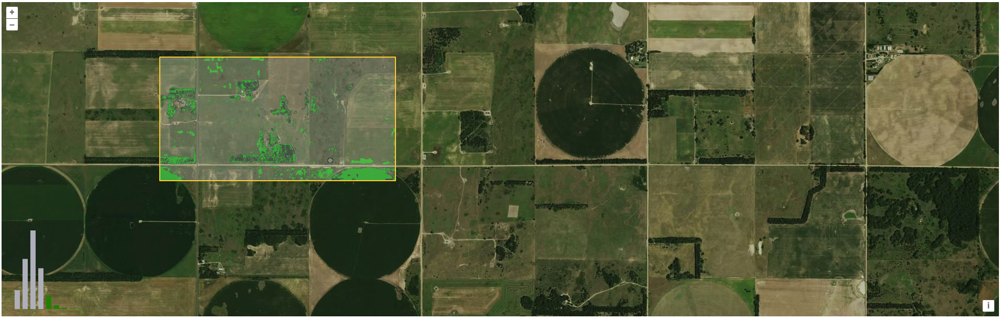
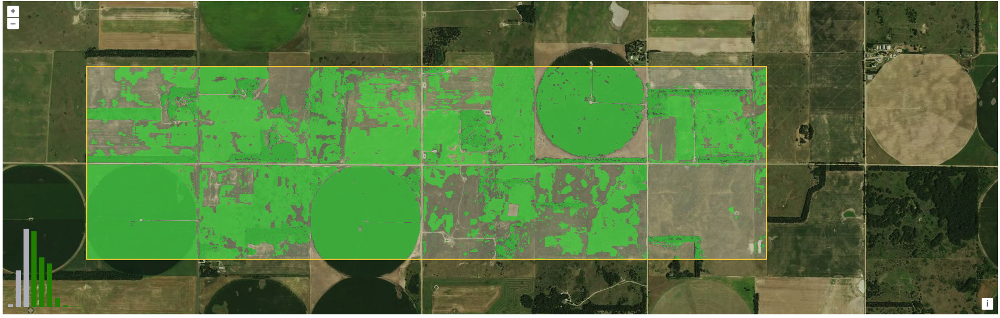

# Vegetation Greenness Demo (OpenLayers)

## Description:
Simple demo project combining Vegetation Greenness with Box drawing

## Screenshots

### How to run the project locally:
1. Run: `npm install` (You'll just need to do this once)
2. Run: `npm run start`
3. Go to the url shown in the output of the `npm run start` command (in the terminal)

### How to deploy the project to production
1. Run: `npm install` (You'll just need to do this once)
2. Run: `npm run build`
3. A new directory will be created called `dist`
4. You have to copy all files and folders from `dist` to the FTP server

## Authors: Konstantine Dvalishvili